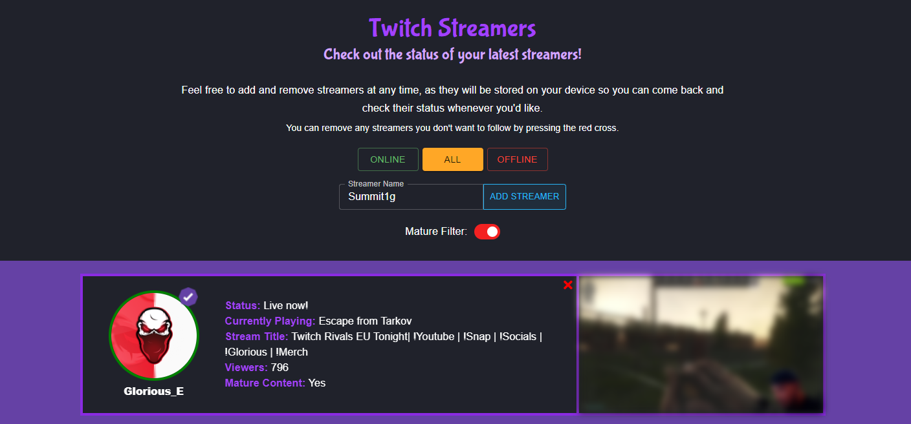
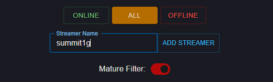
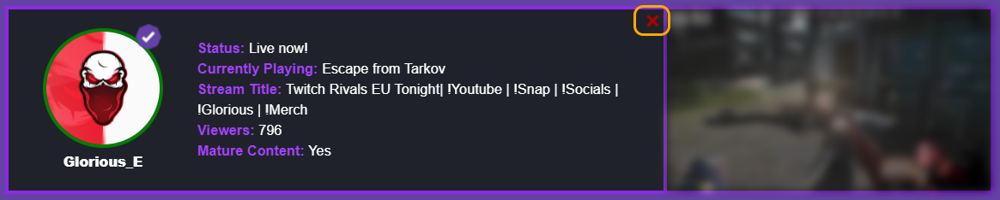

# Twitch Streamers

## Table of Contents
  - [General Information](#general-information)
  - [Installation](#installation)
  - [Usage](#usage)
  - [Adding New Streamers](#adding-new-streamers)
  - [Removing Streamers](#removing-streamers)
  - [Technologies](#technologies)
  - [Status](#status)
  - [Todo](#todo)

## General Information

Twitch Streamers is an app that can keep track of any amount of stream(er)s and what their current status is. This includes stats such as a current screenshot of their stream, current/last played game, if they're live or when they were last live, etc. All of the streamers are saved into LocalStorage, so they will be saved on your device for when you visit next time.

You can also filter between online, offline and all users, just incase your list is too long or you want to check the status of certain streamers.

Some streamers have mature content that may not be suitable to show to younger audiences. To avoid showing mature content in the stream preview you can switch the "Mature Filter" on to blur out the preview.

## Installation

To install the application you will need to clone the repository by running `git clone https://github.com/jamesgower/twitch-api.git`, or alternatively you can download the contents of the repository in a zip folder. Once the repository has been downloaded you can run the app locally by going navigating to the root directory of the repository and running `npm run start` from CLI. The app can then be found at http://localhost:3000.

## Usage

To application can be accessed through [this](https://twitch-streamer-api.netlify.app/) link (https://twitch-streamer-api.netlify.app/). You can alternatively view the application by cloning or downloading it with the method above.

Note: The application will not run correctly if you clone or download the repository without inputting your own Twitch client ID and client secret into the environment variables.

Once the app is loaded you will be greeted with a few predefined streamers, all of which you are welcome to remove and add your own. Streamers can be removed by clicking the red 'X' in the corner of the container.
### Adding New Streamers

To add a new streamer to the list you simply need to input the name of the streamer and click the "Add Streamer" button. If the streamer name is valid it will be added to the streamers list and you will be able to check the status of the stream.

### Removing Streamers

To remove streamers from your list you simply need to click the red cross in the corner of the streamers information, as shown below.

## Technologies

- React 17
- Create-React-App (TypeScript template)
- TypeScript
- MUI (Material UI)
- SCSS
- Netlify (Hosting)
- DayJS